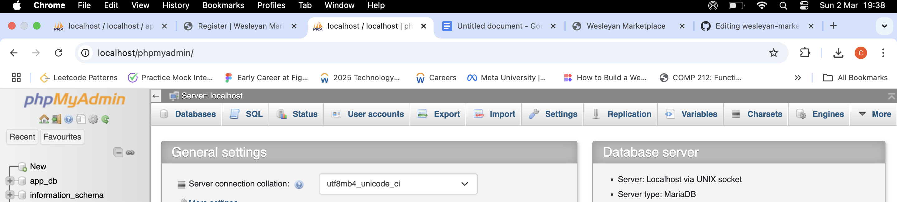

📌 Wesleyan Marketplace

📢 Project Overview
The Wesleyan Marketplace is a campus-based online platform designed to facilitate student-to-student transactions. Students can buy, sell, or trade items such as textbooks, dorm furniture, and essential supplies. The marketplace also provides a space for students to offer or request services such as tutoring, ridesharing, and freelance work.

🏆 Features
- Swap & Sell: List and find second-hand items from fellow students.
- Student Services: Offer and request tutoring, rides, and more.
- Exclusive Deals: Access special student discounts.
- Testimonials: Read feedback from students about their experiences.
- Responsive Design: Fully optimized for mobile and desktop.
- Secure Transactions: Provides a safe and transparent way to exchange goods and services.

👥 Team Members
- Deborah-Gifty Afia Lalude (@dlalude)
- Chukwudi (@Chukwudi)

🚀 How to Run the Project 
Viewing the Deployed Site
The project is deployed on GitHub Pages and can be accessed at:
(https://dlalude.github.io/wesleyan-marketplace/)

Cloning the Repository and Running Locally
1. Clone the Repository
   ```sh
   git clone https://github.com/your-github-username/wesleyan-marketplace.git
   cd wesleyan-marketplace
   ```
2. Open `index.html` in a Browser
   - The project is a static website, so no server setup is needed.
   - Simply open `index.html` in any modern web browser. Note: Chrome may display a security warning; for a better experience, use Safari or another browser.

### **Performance Results & Best Experience Recommendations**
We achieved **95+ scores** for both **mobile and desktop** on performance, accessibility, best practices, and SEO using **Lighthouse**.

#### **Optimizing Your Experience**
- **Browser Extensions Impact Performance**: Having multiple browser extensions installed can negatively impact page load times and performance scores.
- **Recommended Viewing Mode**: For the **best and most optimal experience**, we recommend opening the site in **Incognito Mode (Private Browsing Mode)**, as this disables most extensions that could interfere with performance.
- **Supported Browsers**: While the site works well across all modern browsers, we recommend using **Google Chrome, Safari, or Firefox** for the smoothest experience.


📊 Contribution Percentages

| Deborah-Gifty     | 50%            |
| Chukwudi          | 50%            |

📜 License
This project is licensed under the [MIT License](LICENSE).

📢 Disclaimer
This site was designed and published as part of the COMP 333 Software Engineering class at Wesleyan University. This is an exercise.


Homework #2 Notes...

Link to deployed site -- https://wesleyanmarketplace.wuaze.com


<br> </br>



📝 Local Database Setup Instructions

Start Apache & MySQL
Open XAMPP and start Apache and MySQL.
Open phpMyAdmin at http://localhost/phpmyadmin.

Note: We must create the following database and tables in phpMyAdmin locally.

Database Name: app-db

SQL Queries to Create Tables:

-- Create Users Table
CREATE TABLE users (
    username VARCHAR(255) PRIMARY KEY,
    password VARCHAR(255) NOT NULL
);

-- Create Listings Table
CREATE TABLE listings (
    id INT AUTO_INCREMENT PRIMARY KEY,
    username VARCHAR(255),
    item_name VARCHAR(255) NOT NULL,
    description TEXT NOT NULL,
    price DECIMAL(10,2) NOT NULL,
    FOREIGN KEY (username) REFERENCES users(username) ON DELETE CASCADE
);

-- Verify Setup
SHOW TABLES;
SELECT * FROM users;
SELECT * FROM listings;

ensure dp.php matches
<?php
$servername = "localhost";
$username = "root"; // Default for XAMPP
$password = ""; // No password by default
$dbname = "app_db";

$conn = new mysqli($servername, $username, $password, $dbname);

if ($conn->connect_error) {
    die("Connection failed: " . $conn->connect_error);
}
?>

